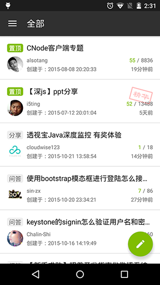
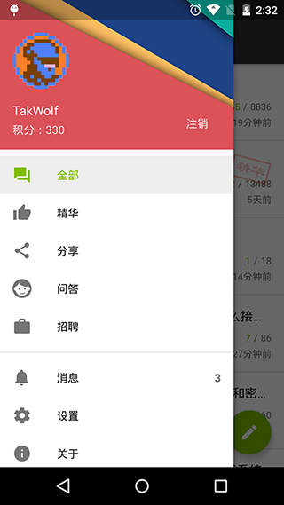
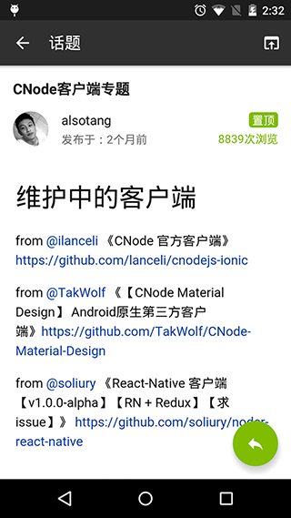

# CNode Material Design

[](https://travis-ci.org/TakWolf/CNode-Material-Design)
[](https://github.com/TakWolf/CNode-Material-Design/releases/latest)
[](https://www.android.com)
[](https://android-arsenal.com/api?level=14)
[](http://www.apache.org/licenses/LICENSE-2.0)


[CNode 社区](https://cnodejs.org)第三方 Android 客户端，原生 App，Material Design 风格，支持夜间模式。

## Downloads

[](https://play.google.com/store/apps/details?id=org.cnodejs.android.md)

- [Google Play](https://play.google.com/store/apps/details?id=org.cnodejs.android.md)

- [FIR.im](http://fir.im/CNodeMD)

- [360手机助手](http://zhushou.360.cn/detail/index/soft_id/3060683)

- [应用宝](http://android.myapp.com/myapp/detail.htm?apkName=org.cnodejs.android.md)

- [魅族应用商店](http://app.flyme.cn/apps/public/detail?package_name=org.cnodejs.android.md)

- [小米应用商店](http://app.mi.com/detail/118728)

- [豌豆荚](http://www.wandoujia.com/apps/org.cnodejs.android.md)

- [酷安](http://www.coolapk.com/apk/org.cnodejs.android.md)

## Screenshots

 

 

## Dependencies

- [Butter Knife](https://github.com/JakeWharton/butterknife)

- [Glide](https://github.com/bumptech/glide)

- [Gson](https://github.com/google/gson)

- [Joda-Time](http://www.joda.org/joda-time)

- [Joda-Time-Android](https://github.com/dlew/joda-time-android)

- [OkHttp](https://github.com/square/okhttp)

- [Retrofit](https://github.com/square/retrofit)

- [Android-HeaderAndFooterRecyclerView](https://github.com/TakWolf/Android-HeaderAndFooterRecyclerView)

- [CircleImageView](https://github.com/hdodenhof/CircleImageView)

- [MaterialEditText](https://github.com/rengwuxian/MaterialEditText)

- [materialish-progress](https://github.com/pnikosis/materialish-progress)

- [QRCodeReaderView](https://github.com/dlazaro66/QRCodeReaderView)

- [PhotoView](https://github.com/chrisbanes/PhotoView)

- [MarkdownPapers](http://markdown.tautua.org)

- [jsoup](https://jsoup.org)

- [CNode-OAuth-Login-Android](https://github.com/TakWolf/CNode-OAuth-Login-Android)

- [CNodeMD Page Render Compat](https://github.com/TakWolf/CNodeMD-Page-Render-Compat)

- [Material design icons](https://github.com/google/material-design-icons)

- [Vue.js](http://cn.vuejs.org)

- [github-markdown-css](https://github.com/sindresorhus/github-markdown-css)

## License

```
Copyright 2015 TakWolf

Licensed under the Apache License, Version 2.0 (the "License");
you may not use this file except in compliance with the License.
You may obtain a copy of the License at

    http://www.apache.org/licenses/LICENSE-2.0

Unless required by applicable law or agreed to in writing, software
distributed under the License is distributed on an "AS IS" BASIS,
WITHOUT WARRANTIES OR CONDITIONS OF ANY KIND, either express or implied.
See the License for the specific language governing permissions and
limitations under the License.
```
